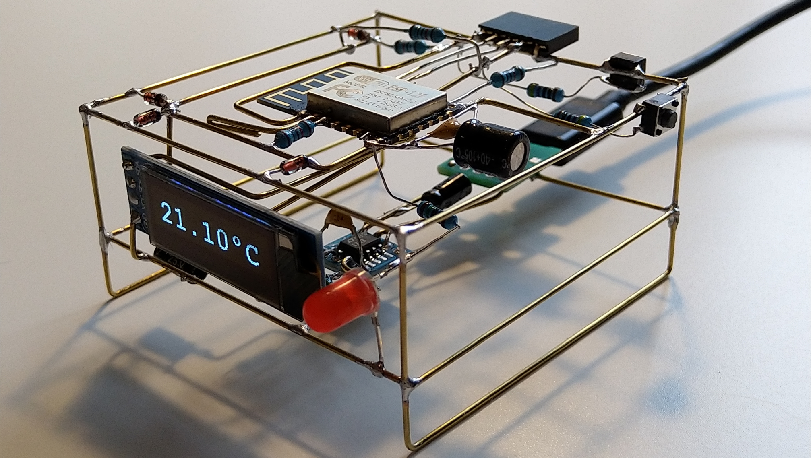

# RoomMonitorClient

Software/firmware for a ESP8266 OLED MQTT client for DYI [room conditions monitor](https://github.com/josefadamcik/RoomMonitor).

PlatformIO is used to build this project but it should be easy to convert it back to a project for Arduino IDE.

More information can be found in this blog post:

- [Freeform ESP8266 OLED MQTT client](https://josef-adamcik.cz/electronics/freeform-esp8266-based-mqtt-oled-client.html)

